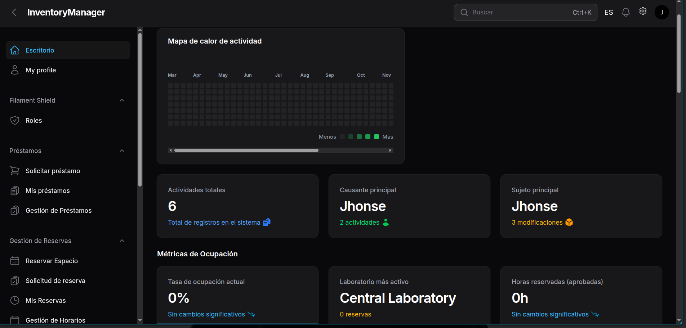
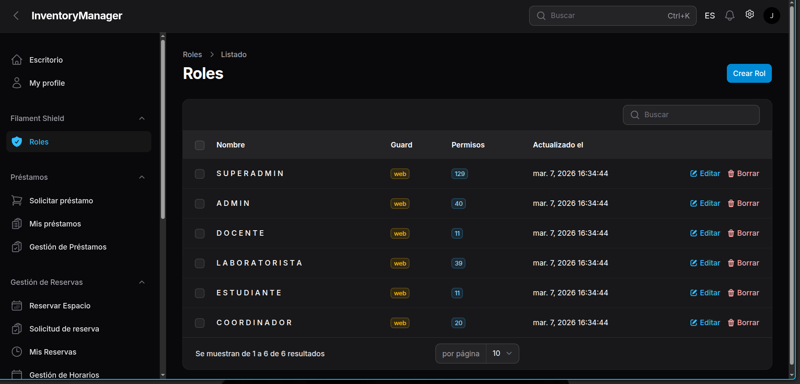
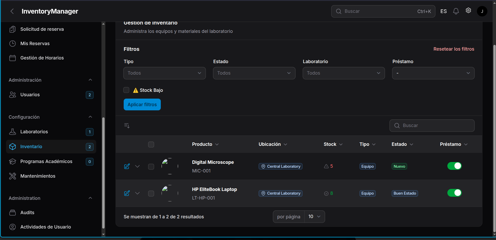
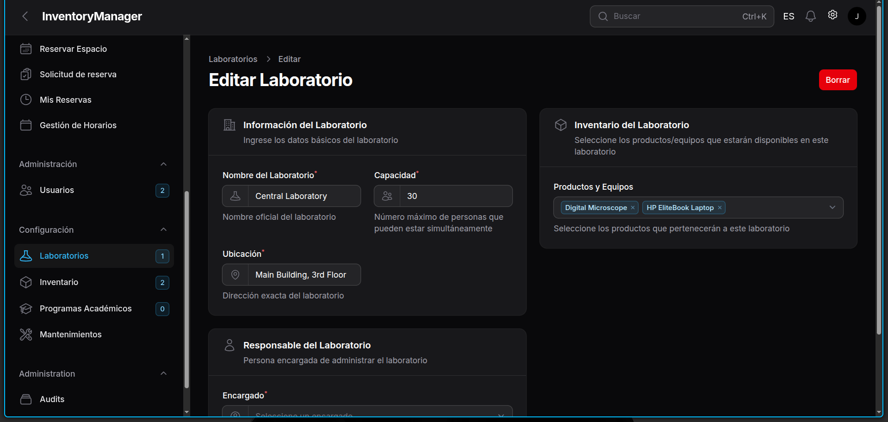

# InventoryManager


InventoryManager is a Laravel + Filament web application for laboratory inventory management.  
It centralizes stock control, reservations, loans, schedules, and auditability for academic environments.

## System Preview

### Login


### Dashboard


### Inventory Module


### Booking & Calendar Module


> Note: Screenshots are stored in `docs/screenshots/`. If you rename files, update these paths.

## Problem It Solves
- Dispersed manual records for equipment and supplies.
- Low traceability of reservations and loans.
- Slow administrative workflows for lab staff.

## Core Features
- Product and stock management with minimum stock tracking.
- Booking lifecycle management.
- Loan registration and return control.
- Laboratory schedules and calendar views.
- Role and permission control (admin-oriented workflows).
- Export/report endpoints for operational monitoring.
- Activity logging for critical actions.

## Tech Stack
- PHP 8.3+
- Laravel 12
- Filament 5
- MySQL (dev/prod) + SQLite (tests/CI)
- Node.js 20+ (recommended)

## Local Setup
```bash
composer install
npm install
cp example.env .env
# or: cp .env.example .env
php artisan key:generate
php artisan migrate --seed
php artisan serve
npm run dev
```

Admin panel URL: `http://127.0.0.1:8000/admin`

## Demo Credentials
The seeded super-admin user is controlled by environment variables:
- `SUPER_ADMIN_EMAIL` (default: `admin@example.com`)
- `SUPER_ADMIN_PASSWORD` (required for deterministic credentials)

If `SUPER_ADMIN_PASSWORD` is empty, the seeder generates a temporary password and prints it in the console.

## Quality Signals
- Automated tests with PHPUnit.
- CI workflow includes lint, tests, and frontend build.
- Access-control and admin route smoke tests included.

Run quality checks locally:
```bash
php artisan test
./vendor/bin/pint --test
npm run build
```

## Security Notes
- Never commit real secrets in `.env`.
- Validate production values for `APP_ENV`, `APP_DEBUG`, DB and mail settings.
